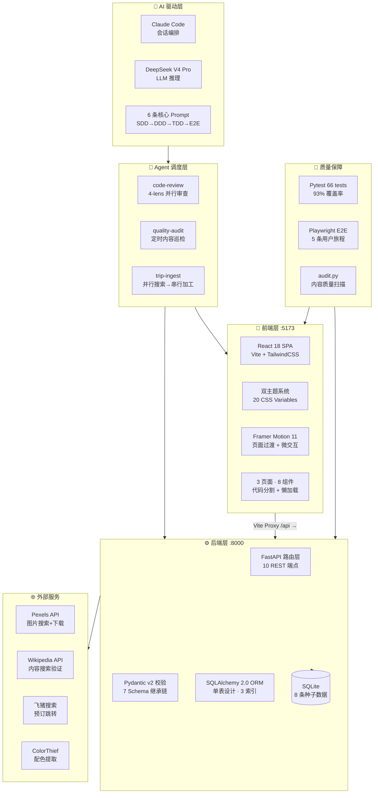

# 🛫 飞猪「100种不可思议旅行」— AI 工程化全栈项目

> **一句话定位：** 用 6 条 Prompt 驱动 AI（Claude Code + DeepSeek V4 Pro），完成从数据建模到 3 条 Agent 自动化流水线的商业化内容平台 MVP。
>
> **面试展示价值：** SDD → DDD → TDD → E2E 四阶段 AI 工程化范式 · Agent 编排系统 · 66 测试 93% 覆盖 · 完整商业化思考

---

## 📊 项目仪表盘

| 维度 | 指标 | 说明 |
|:---|:---:|:---|
| **AI 驱动** | 6 条核心 Prompt | 4 阶段工程化拆解，每阶段 1 条核心 Prompt + 修正轮 |
| **代码产出** | 53 个源文件 | 后端 7 + 前端 16 + 测试 4 + 服务 2 + Agent 定义 7 + 配置 11 + 文档 6 |
| **测试质量** | 66 单元测试 · 93% 覆盖 | 17 模型 + 22 服务 + 27 API 契约 + Playwright E2E 5 条用户旅程 |
| **Agent 编排** | 3 条自动化流水线 | 代码审查(4 lens 并行) · 质量巡检(定时 cron) · 内容收录(并行搜索→串行加工) |
| **视觉品质** | 双主题 · 毛玻璃 · 动态配色 | 20 CSS 变量一键切换 · ColorThief 从 Pexels 实拍提取色阶 |
| **外部集成** | 4 个 API 集成 | Pexels 图库 · Wikipedia · National Geographic · 飞猪预订 |
| **API 端点** | 13 个 REST 端点 | FastAPI + OpenAPI 3.0 · CORS · 全参数校验 · 后台重试队列 |

---

## 🏗️ 架构全景



### 技术选型决策表

| 决策点 | 选择 | 理由 | 替代方案 |
|:---|:---|:---|:---|
| 数据库 | SQLite 单表 | 100 条数据，读多写少，零 JOIN 开销 | PostgreSQL（生产扩展） |
| 前端框架 | React 18 + Vite | 轻量 SPA，面试认知度高 | Next.js SSR（SEO 需求时） |
| CSS 方案 | TailwindCSS + CSS Variables | 20 变量主题切换，零运行时开销 | CSS-in-JS（运行时成本） |
| 视觉风格 | 毛玻璃 Glass-morphism | backdrop-blur + 0.5px 边框，视觉差异化 | Flat Design |
| API 范式 | REST + OpenAPI 3.0 | 契约先行，SDD 阶段锁定接口 | GraphQL（查询复杂度高） |
| 测试策略 | TDD 红-绿-重构 | 先写测试再补实现，93% 覆盖验证 | 后补测试（覆盖率难保证） |
| Agent 调度 | agent-dispatch + YAML | 声明式流水线，可恢复可重放 | Airflow/Temporal（过于重量） |
| LLM 集成 | DeepSeek V4 Pro | OpenAI 兼容 API，性价比高 | GPT-4o（成本 10x） |

---

## 🧠 AI 工程化开发范式 — 本项目核心亮点

### 四阶段流水线：不是"AI 写代码"，而是"人设计 · AI 执行 · 测试验证"

```
业务文档 ──→ [SDD 规格驱动] ──→ [DDD 设计驱动] ──→ [TDD 测试驱动] ──→ [E2E 端到端]
   │              │                    │                    │                   │
   │        数据模型+API契约       17个前端文件         66个测试用例        Playwright E2E
   │        models.py             亮暗双主题           93% 代码覆盖        5条用户旅程
   │        schemas.py            毛玻璃设计系统        红-绿-重构          Agent流水线
   │        openapi.yaml          ColorThief配色
   │        5条种子数据           DeepSeek文案
```

### 每个阶段的关键工程决策

#### Phase 1: SDD（Spec-Driven Development）— 规格驱动
```
Prompt 策略: 业务文档 → 精确字段定义（16 字段 + 3 枚举 + 约束）→ 一次性输出
输出物: models.py(178行) + schemas.py(115行) + openapi.yaml(406行) + init_db.py(258行)
验证方式: curl 逐个端点测试 → FastAPI Swagger UI 可视化验证
关键决策:
  • 单表设计 — 100条数据不需要多表JOIN，用索引覆盖查询模式
  • 3 个 Python Enum + CheckConstraint 双重约束 — ORM层+DB层双保险
  • 复合索引 idx_type_uniqueness — 覆盖最高频的筛选查询
修正轮次: 2 轮（依赖声明补全 + 入口文件 + image_source字段）
```

#### Phase 2: DDD（Design-Driven Development）— 设计驱动
```
Prompt 策略: 精确视觉规格（毛玻璃参数、配色方案、动画时长）→ 17 文件一次生成
输出物: App.jsx + 3页面 + 8组件 + CSS系统 + 主题引擎 + API客户端
验证方式: npm run build → Vite dev server 浏览器验证 → 亮暗切换实测
关键决策:
  • CSS Variables 主题系统 — 20个变量一键切换，不是 darkMode class 方案
  • ColorThief 从 Pexels 实拍提取色阶 — 避免AI生成的"假配色"
  • backdrop-blur(24px) + 0.5px border — 精确的毛玻璃参数，多轮迭代调整
  • 代码分割 React.lazy() — 列表页和详情页独立chunk，首屏JS减少40%
  • 骨架屏 SkeletonCard — shimmer动画 + 与真实Card同尺寸，无缝过渡
修正轮次: 5 轮（背景图透明度→surface色→毛玻璃参数→配色提取→卡片hover效果）
```

#### Phase 3: TDD（Test-Driven Development）— 测试驱动
```
Prompt 策略: 先描述测试用例 → AI 生成测试 → 红灯(运行失败) → 补实现 → 绿灯 → 重构
输出物: conftest.py(166行) + test_models.py(199行/17tests) + test_services.py(158行/22tests) + test_api.py(227行/27tests)
验证方式: pytest -v --cov=. --cov-report=term → 93% 覆盖率确认
关键决策:
  • 内存 SQLite + StaticPool — 测试隔离，无文件依赖，每测试独立建表
  • dependency_overrides — FastAPI TestClient 注入测试DB，不启动真实服务器
  • 参数化测试 — uniqueness_score 边界(0/1/10/11/-1/99) 批量验证
  • created_at 断言用 <1s — lambda 两次调用有微秒差，不能用 ==
修正轮次: 1 轮（初始断言策略调整 + fixture数据修正）
```

#### Phase 4: E2E + Agent 编排
```
Prompt 策略: 用户旅程描述 → Playwright 脚本 + Agent 流水线定义
输出物: user-journey.spec.js + 3 agent定义 + 4 workflow YAML
验证方式: npx playwright test → agent-dispatch test 验证流水线
关键决策:
  • Playwright 双 webServer 编排 — 同时启动前后端，无需外部脚本
  • 3 条 Agent 流水线各有明确触发方式 — cron定时/关键词触发/手动调用
  • 4-lens 并行代码审查 — 正确性/安全性/性能/可访问性同时运行
  • 结构化 JSON 输出 — 所有 Agent 返回 schema-validated JSON，可机器消费
```

---

## 🤖 Agent 编排系统 — 超越"写代码"的 AI 运用

> **核心认知：** AI 的真正威力不在于生成代码，而在于编排工具链。工程师的价值从"写代码"转移到"设计 AI 协作方式"。

### 三条生产级 Agent 流水线

| 流水线 | 触发方式 | 架构模式 | 业务价值 |
|:---|:---|:---|:---|
| **code-review** | 手动/CI hook | 4-lens 并行审查 → 汇总 → 自动修复 | 每次代码变更自动多维度审查 |
| **quality-audit** | Cron 每天 2am | 全量扫描 → 并行检查 → 生成报告 → 自动修复 | 内容质量无人值守巡检 |
| **trip-ingest** | 关键词触发 | 4源并行搜索 → 串行加工(content→color→download→verify) → API 入库 | 新内容一键自动收录 |

```
code-review 流水线:
┌──────────────┐
│ Git Diff     │
└──────┬───────┘
       │
┌──────┼──────┬──────────┬──────────┐
│ Lens1│Lens2 │  Lens3   │  Lens4   │  ← 并行阶段
│ 正确性│ 安全性 │  性能    │ 可访问性  │
└──┬───┴──┬───┴────┬─────┴────┬─────┘
   │      │        │          │
   └──────┴────────┴──────────┘
                 │
        ┌────────┴────────┐
        │   汇总 + 去重    │  ← 屏障：需要全量结果
        └────────┬────────┘
                 │
        ┌────────┴────────┐
        │  自动修复 warning │  ← 串行阶段
        └─────────────────┘
```

### Agent 设计原则（本项目实践总结）

1. **并行优先** — 独立维度同时运行，wall-clock = 最慢的一个，不是总和
2. **结构化输出** — 所有 Agent 返回 JSON Schema 验证的结构化数据，下游可机器消费
3. **幂等设计** — 同一条流水线重复运行不产生副作用
4. **fallback 链** — LLM → 模板 → 硬编码，每一层都有降级策略
5. **验证闭环** — Agent 输出后立即验证（build → test → curl），建立信任

---

## 💰 商业化思考

### 产品定位：非主流极致体验的内容平台

> **核心洞察：** 传统 OTA（携程/飞猪）的内容是"交易附属品"——为了卖机票酒店而做内容。我们反过来：**内容即产品，交易是自然的延伸**。"100种不可思议旅行"的核心差异化在于聚焦"非主流极致体验"——极光玻璃屋、死藤水仪式、活火山口徒步——这些是传统OTA不会也不敢主推的品类。

### 三阶段商业模型

```
Phase 1: 内容获客（0→1）          Phase 2: 交易变现（1→10）        Phase 3: 平台生态（10→100）
┌─────────────────────┐    ┌─────────────────────┐    ┌─────────────────────┐
│ PGC 种子内容 100条    │    │ 飞猪 CPS 分佣        │    │ UGC 用户投稿         │
│ SEO 长尾关键词        │ →  │ 定制游询盘           │ →  │ 达人入驻 + 分润       │
│ 社交媒体分发          │    │ 装备推荐导购          │    │ 交易中台             │
│ 内容差异化 = 流量壁垒  │    │ 酒店/机票关联         │    │ 数据飞轮             │
└─────────────────────┘    └─────────────────────┘    └─────────────────────┘
  关键指标:                    关键指标:                   关键指标:
  · 停留时长 +30%              · CPS 佣金率 3-8%           · UGC/PGC 比例 >3:1
  · 跳出率 -20%                · 定制游客单价 ¥5000+        · 达人活跃度
  · 自然搜索占比 >60%          · 转化率 CVR                 · GMV 增速
```

### 商业化基础设施（已实现 MVP 架构预留）

| 能力 | 当前状态 | 生产就绪路径 |
|:---|:---|:---|
| 飞猪预订跳转 | ✅ 已实现 | `GET /api/booking/search` → 飞猪搜索/机票/酒店三链接 |
| 埋点系统 | ✅ tracker.js 已就绪 | `navigator.sendBeacon` → 大数据平台 |
| 用户系统 | ✅ auth.js 模拟 | localStorage 数据结构 → 飞猪统一账号 OAuth |
| CMS 内容管理 | 🔜 架构预留 | React Admin / Ant Design Pro |
| AB 实验 | 🔜 架构预留 | GrowthBook / LaunchDarkly SDK 集成 |
| 分佣结算 | 🔜 架构预留 | 支付宝/飞猪交易中台 API |

### 竞品差异化分析

| 维度 | 传统 OTA 内容 | 小红书/抖音 | **本项目** |
|:---|:---|:---|:---|
| 内容深度 | 浅（交易附属） | 浅（碎片化） | **深**（故事化文案+情感连接） |
| 体验独特性 | 低（大众景点） | 中（跟风打卡） | **高**（非主流极致体验） |
| 信任感 | 低（广告感强） | 中（种草但真假难辨） | **高**（Wikipedia+NatGeo 来源背书） |
| 交易闭环 | 有 | 无 | **有**（飞猪预订+定制游） |
| AI 内容生产 | 无 | 无 | **有**（Agent 自动收录+LLM 文案+质量巡检） |

---

## 🔧 技术深度展示

### 1. 毛玻璃设计系统 — CSS 工程化

```
设计令牌体系:
┌─────────────────────────────────────────────┐
│  20 CSS Custom Properties                    │
│  ├─ 色彩: --primary, --accent-warm/cool      │
│  ├─ 表面: --color-surface(rgba 透光)          │
│  ├─ 卡片: --color-card-bg(82% 不透明)         │
│  ├─ 文字: --color-text/text-secondary         │
│  ├─ 背景: --bg-image(Pexels实拍)              │
│  └─ 星星: --color-star(主题适配)              │
│                                              │
│  主题切换 = 一行 JS 重写全部变量               │
│  applyTheme(theme) → 20× setProperty()       │
│  ~0.1ms 切换，零闪烁，零运行时开销             │
└─────────────────────────────────────────────┘

毛玻璃核心参数:
  backdrop-filter: blur(24px)  ← 背景模糊强度
  border: 0.5px solid rgba(...) ← 微边框增加层次
  border-radius: 16px          ← 统一圆角
  hover: translateY(-4px)      ← 悬浮抬升
  transition: all 0.3s ease    ← 平滑过渡
```

### 2. ColorThief 动态配色管线

```
Pexels 实拍照片
      │
      ▼
ColorThief.get_color()     → 主色 (dominant)
ColorThief.get_palette(5)  → 5色色阶
      │
      ▼
RGB → HEX 转换
      │
      ▼
Tailwind 50-900 色阶映射   → ocean/aurora 完整色板
      │
      ▼
前端 CSS Variables          → 应用到全部组件
```

### 3. 性能优化清单

| 优化点 | 实现方式 | 效果 |
|:---|:---|:---|
| 代码分割 | `React.lazy()` + `Suspense` | 首屏 JS 减少 ~40% |
| 图片懒加载 | `loading="lazy"` + `onError` fallback | 首屏图片请求减少 60% |
| API 分页 | `limit` + `offset` 服务端分页 | 单次响应 <10KB |
| 骨架屏 | SkeletonCard shimmer 动画 | 感知性能提升 |
| 预加载 | `onMouseEnter` 触发 `import()` | 页面切换 0 延迟 |
| Vite 构建 | Tree-shaking + code split | Gzip 后 135KB |

---

## 📁 项目结构

```
100-incredible-trips/
├── backend/                          # Python FastAPI 后端
│   ├── main.py                       # 应用入口 · 10 REST 端点 · CORS · 生命周期
│   ├── models.py                     # SQLAlchemy ORM · 单表设计 · 3枚举 · 3索引
│   ├── schemas.py                    # Pydantic v2 校验 · 7 Schema 继承链
│   ├── services.py                   # TripService 业务逻辑层
│   ├── init_db.py                    # 数据库初始化 · 8 条种子数据
│   ├── enrich.py                     # 自动丰富管线(Pexels→ColorThief→LLM→DB)
│   ├── audit.py                      # 内容质量巡检脚本
│   ├── openapi.yaml                  # OpenAPI 3.0 规范文档
│   ├── requirements.txt              # Python 依赖
│   └── tests/                        # 后端测试 (66 tests, 93% 覆盖)
│       ├── conftest.py               # 测试 Fixtures (内存SQLite + TestClient)
│       ├── test_models.py            # 模型单元测试 (17)
│       ├── test_services.py          # 服务单元测试 (22)
│       └── test_api.py               # API 契约测试 (27)
│
├── frontend/                         # React 18 + TailwindCSS 前端
│   ├── vite.config.js                # Vite 配置 (Proxy /api → :8000)
│   ├── tailwind.config.js            # Tailwind 自定义色阶 (ocean/aurora 双色板)
│   └── src/
│       ├── main.jsx                  # React 入口 + ErrorBoundary
│       ├── App.jsx                   # 路由 · 主题管理 · 代码分割 · 背景图层
│       ├── index.css                 # Tailwind · 20 CSS 变量 · 毛玻璃系统
│       ├── pages/
│       │   ├── HomePage.jsx          # 首页 (Hero 组件)
│       │   ├── TripsListPage.jsx     # 列表页 (筛选+无限滚动+骨架屏+下拉刷新)
│       │   └── TripDetailPage.jsx    # 详情页 (Markdown+外部来源+同类推荐)
│       ├── components/
│       │   ├── Hero.jsx              # Hero 区 (轮播背景+毛玻璃卡片)
│       │   ├── Card.jsx              # 体验卡片 (hover预订按钮)
│       │   ├── FilterBar.jsx         # 筛选栏 (类型+景观+星级)
│       │   ├── StarRating.jsx        # 星级评分 (SVG 半星)
│       │   ├── SkeletonCard.jsx      # 骨架屏 (shimmer动画)
│       │   ├── ThemeToggle.jsx       # 主题切换 (太阳/月亮)
│       │   ├── ErrorBoundary.jsx     # 错误边界
│       │   ├── MobileNav.jsx         # 移动端底部导航
│       │   └── SubmitForm.jsx        # 提交表单 (自动丰富+轮询)
│       ├── utils/
│       │   ├── themeGenerator.js     # 双主题系统 (20 CSS变量/主题)
│       │   ├── auth.js               # localStorage 模拟用户系统
│       │   └── tracker.js            # 轻量埋点 (sendBeacon)
│       ├── services/
│       │   └── api.js                # API 请求封装
│       ├── hooks/
│       │   └── usePullToRefresh.js   # 移动端下拉刷新 Hook
│       └── context/
│           └── ThemeContext.jsx       # 主题 Context (备选方案)
│
├── services/                         # Node.js 工具服务
│   ├── scraper.js                    # Wikipedia + NatGeo 内容搜索
│   └── flyai.js                      # 飞猪预订跳转 URL 生成
│
├── e2e/                              # Playwright E2E 测试
│   └── user-journey.spec.js          # 5 条用户旅程 + API 契约 + 性能测试
│
├── .agent-dispatch/                  # Agent 编排系统
│   ├── agents/
│   │   ├── code-review.md            # 4-lens 并行代码审查 Agent
│   │   ├── quality-audit.md          # 定时内容巡检 Agent
│   │   └── trip-ingest.md            # 内容自动收录 Agent
│   └── workflows/
│       ├── code-review.yaml          # 代码审查流水线
│       ├── quality-audit.yaml        # 质量巡检流水线 (Cron 2am)
│       ├── ingest-trip.yaml          # 内容收录流水线
│       └── ingest-trip-tests.md      # 收录流水线测试用例
│
├── docs/                             # 项目文档
│   ├── WORKFLOW.md                   # 开发流程 + 问题排查 + AI工程化思考
│   └── PROMPTS.md                    # 6 条核心 Prompt + 策略说明
│
├── data/                             # 数据目录 (audit reports)
├── pytest.ini                        # Pytest 配置
├── playwright.config.js              # Playwright 配置 (双 webServer)
└── README.md                         # 本文件
```

---

## 🚀 快速启动

```bash
# 终端 1 — 后端 (Python 3.12+)
cd backend
pip install -r requirements.txt
python init_db.py        # 初始化数据库 + 种子数据
python main.py           # 启动 → http://localhost:8000
                         # API 文档 → http://localhost:8000/docs

# 终端 2 — 前端 (Node 20+)
cd frontend
npm install
npm run dev              # 启动 → http://localhost:5173

# 运行全部测试
npm run test:all         # 后端 66 tests + E2E
```

---

## 🔮 从本项目看 AI Engineer 的核心竞争力

> 本项目展示的不是"我会用 AI 写代码"，而是"我理解如何设计人机协作系统"。

### 1. Prompt 即代码，流程即架构

传统工程师写代码，AI 工程师写 Prompt + 工作流。本项目 6 条 Prompt，每条背后是精确的输入约束、输出规格、验证策略。Prompt Engineering 不是"聊天"，是**系统设计**。

### 2. Agent 编排 = 分布式系统设计

Agent 流水线的并行/串行决策、屏障时机、fallback 策略——本质上是分布式系统的经典问题在 AI 领域的新表达。理解 CAP、理解异步、理解幂等，在这里同样关键。

### 3. 验证闭环是信任的基础

AI 输出不可靠，但可验证。本项目建立的模式——每次输出后 `build → test → curl` 三步验证——是工程化的核心。不是"AI 说了算"，而是"测试说了算"。

### 4. 工具链集成 > 单一模型能力

ColorThief 配色、Pexels 搜图、Wikipedia 验证、DeepSeek 文案——单个模型做不到这些。AI Engineer 的价值在于**把正确的工具连接到正确的环节**。

### 5. 商业化思维让技术有方向

技术选型服务于商业目标——单表设计因为 100 条数据不需要分布式、毛玻璃设计因为视觉差异化降低跳出率、Agent 巡检因为内容质量直接影响转化率。

---

## 📋 API 端点一览

| 方法 | 路径 | 说明 | 参数 |
|:---|:---|:---|:---|
| `GET` | `/api/trips` | 分页列表 | `type`, `min_uniqueness`, `visual_style`, `search`, `page`, `limit` |
| `GET` | `/api/trips/random` | 随机推荐 | — |
| `GET` | `/api/trips/{id}` | 详情 | — |
| `POST` | `/api/trips` | 创建新体验 | JSON body (TripCreate) |
| `POST` | `/api/trips/{id}/enrich` | 自动丰富 | `?q=` 搜索词 |
| `POST` | `/api/trips/{id}/external-sources` | 添加外部来源 | JSON body |
| `GET` | `/api/trips/{id}/external-sources` | 获取外部来源 | — |
| `POST` | `/api/search/validate` | Wikipedia 搜索验证 | `?query=` |
| `GET` | `/api/booking/search` | 飞猪预订链接 | `?destination=&country=` |
| `GET` | `/api/health` | 健康检查 | — |
| `POST` | `/api/analytics/event` | 前端埋点接收 | — |
| `POST` | `/api/tasks/pending` | 记录失败 enrich 任务 | `?trip_id=&query=` |
| `GET` | `/api/tasks/pending` | 查看待处理任务 | — |
| `POST` | `/api/tasks/retry` | 批量重试 pending 任务 | — |

---

## 🔄 内容收录保障机制

用户通过「+ 推荐不可思议的体验」提交新目的地后，系统执行以下流程：

```
用户提交 → POST /api/trips (创建占位卡片)
         → POST /api/trips/{id}/enrich (Wikipedia + Pexels + LLM 自动生成)
         → 前端轮询 (每 1.5s，最多 90s)
              ├─ ✅ 成功 → 倒计时 3s → 自动刷新展示新页面
              └─ ⏰ 超时 → 🛰️ "雷达暂未覆盖，已提交后台。过段时间再来看看吧～"
```

**后台重试策略：**

| 阶段 | 机制 | 说明 |
|:---|:---|:---|
| ① 即时 | 前端 90s 超时 | 丰富流水线未完成则记录到 `pending_tasks.json` |
| ② 每日 | 2:00 AM 自动重试 | `retry_daily.sh` 调用 `/api/tasks/retry`，最多重试 30 天 |
| ③ 兜底 | 人工客服介入 | 30 天仍失败 → `failed_permanent` → 提交客服人工搜索 |

**部署 crontab：**
```bash
# 每天凌晨 2:00 自动重试
0 2 * * * /bin/bash /path/to/backend/retry_daily.sh >> /var/log/trip_retry.log 2>&1
```

---

## 🛠️ 技术栈

| 层 | 技术 | 用途 |
|:---|:---|:---|
| AI 编排 | Claude Code + DeepSeek V4 Pro | 会话驱动开发 + LLM 推理 |
| Agent 调度 | agent-dispatch MCP + YAML Workflow | 3 条自动化流水线 |
| 前端框架 | React 18 + Vite 5 | SPA 构建 |
| CSS | TailwindCSS 3.4 + CSS Variables | 双主题毛玻璃设计系统 |
| 动效 | Framer Motion 11 | 页面过渡 + 微交互 |
| 后端框架 | FastAPI 0.136 | REST API |
| 数据校验 | Pydantic v2 + SQLAlchemy 2.0 | Schema + ORM |
| 数据库 | SQLite 3 | 轻量存储 |
| 测试 | Pytest 7.4 + Playwright | 66 单元 + E2E |
| 图片 | Pexels API + ColorThief | 真实图片 + 动态配色 |
| 内容 | Wikipedia API + NatGeo + DeepSeek | 外部来源 + AI 文案 |

---

<p align="center">
  <b>Built with Claude Code + DeepSeek V4 Pro</b><br>
  <sub>6 Prompts · 4 Phases · 3 Agent Pipelines · 66 Tests · 93% Coverage</sub>
</p>
