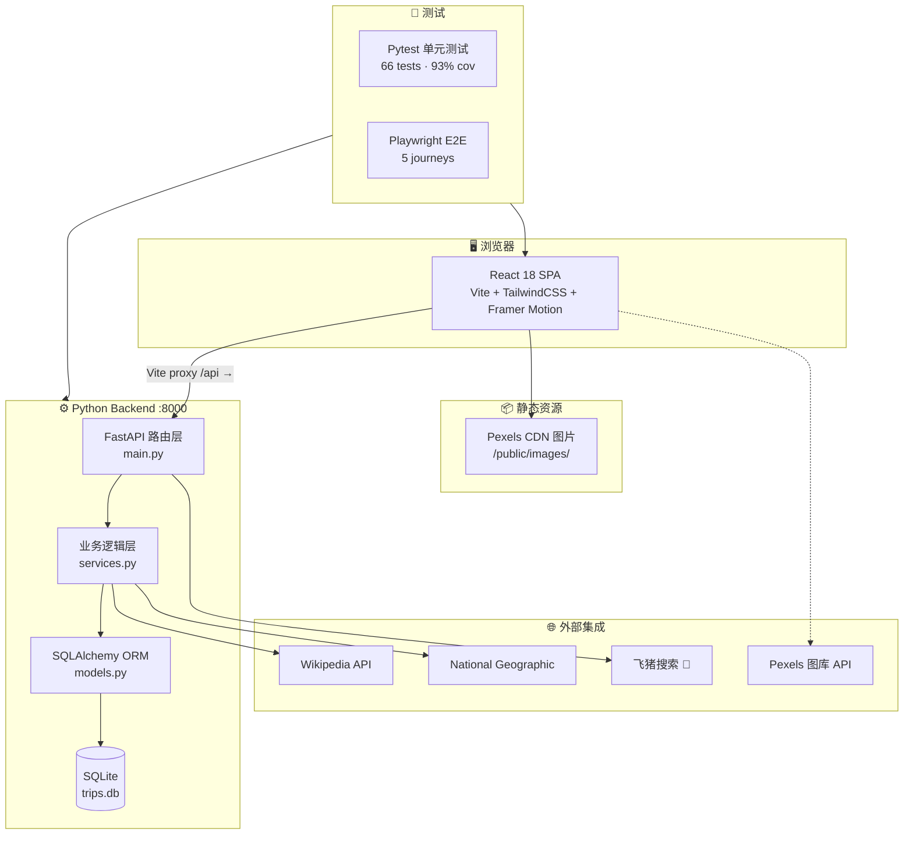
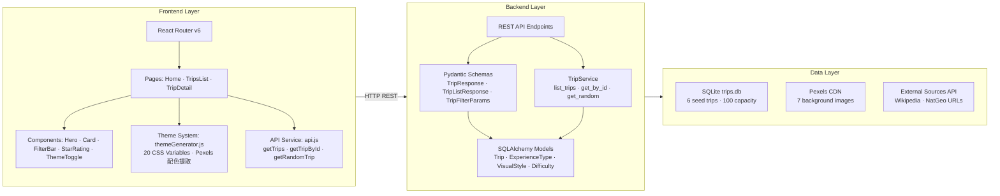

# 🛫 飞猪「100种不可思议旅行」

> 一个以"非主流极致体验"为核心差异化的旅行内容平台 MVP。
> 后端 Python/FastAPI + 前端 React/TailwindCSS + 双主题动态配色。

---

## 总体架构图



---

## 技术架构图



---

## 成品功能清单

### ✅ 已实现（MVP）

| 模块 | 功能 | 状态 | 备注 |
|------|------|:---:|------|
| **内容展示** | 6 条"不可思议"旅行体验（PGC） | ✅ | 含封面图、故事化文案、来源标注 |
| | 响应式卡片网格（3/2/1列） | ✅ | TailwindCSS responsive grid |
| | 无限滚动加载 | ✅ | Intersection Observer |
| | 骨架屏加载态 | ✅ | SkeletonCard shimmer |
| **详情页** | Hero 大图头图 (60vh) | ✅ | 封面图 + 标题/副标题叠加 |
| | 故事化文案（Markdown 渲染） | ✅ | react-markdown |
| | 体验标签（类型/难度/时长/季节） | ✅ | 毛玻璃信息卡 |
| | 景观类型标签（城市/海洋/森林/山峰/雪原） | ✅ | emoji + 中文映射 |
| | 图片来源标注（可点击链接） | ✅ | Flickr CC / Pexels 来源 |
| | 同类体验推荐（2-3条） | ✅ | 同 experience_type 匹配 |
| | 返回顶部按钮 | ✅ | 滚动超过一屏后出现 |
| **筛选系统** | 体验类型筛选（6类胶囊按钮） | ✅ | adventure/cultural/nature/food/art/wellness |
| | 景观类型筛选（5类） | ✅ | urban/ocean/forest/mountain/snow |
| | 不可思议指数筛选（星级点击） | ✅ | 1-5星 → min_uniqueness 映射 |
| | 吸顶毛玻璃筛选栏 | ✅ | sticky + backdrop-blur |
| **搜索** | 关键词全文搜索 | ✅ | 标题/副标题/目的地/国家/内容 |
| **主题** | 暗黑/明亮双模式 | ✅ | 20个CSS变量一键切换 |
| | 动态背景图（Pexels 实拍） | ✅ | 明亮→巴哈马碧蓝海洋，暗黑→极地雪原极光 |
| | ColorThief 配色提取 | ✅ | 从背景图提取主色+色阶 |
| **预订** | 飞猪搜索跳转 | ✅ | 卡片悬停"🎫 预订"按钮 + 详情页 CTA |
| **外部来源** | Wikipedia + National Geographic 链接 | ✅ | 详情页"外部来源"模块 + 社区共建入口 |
| **API** | RESTful API（6端点） | ✅ | 列表/详情/随机/预订搜索/外部来源 CRUD |
| | OpenAPI 3.0 规范 | ✅ | openapi.yaml |
| | CORS 配置 | ✅ | localhost:5173 |
| **测试** | 后端单元测试 66 个 | ✅ | 93% 代码覆盖率 |
| | E2E 测试 (Playwright) | ✅ | 5 条用户旅程 |

### 🟡 部分实现

| 模块 | 功能 | 状态 | 优化建议 |
|------|------|:---:|------|
| **内容feed流** | 双列瀑布流 | 🟡 | 当前为标准3列网格。建议引入 `react-masonry-css` 实现小红书式瀑布流，配合 `virtualized` 优化长列表性能 |
| **下拉刷新** | Pull-to-refresh | 🟡 | 移动端可通过 `useTouchEvents` + CSS `pull-down` 动画实现。建议封装为 `usePullToRefresh` hook |
| **响应式** | 移动端适配 | 🟡 | 桌面/平板已适配，移动端需优化：底部导航栏、触摸手势、图片懒加载 `loading="lazy"` |
| **数据埋点** | 用户行为记录 | 🟡 | 当前无。建议最小化方案：`navigator.sendBeacon` + 自定义 `useTracker` hook，记录 PV/停留/筛选/点击 |

### ⬜ 待实现（Roadmap）

| 层级 | 模块 | 优先级 | 预估工时 |
|------|------|:---:|:---:|
| **L1 核心** | 瀑布流布局 | P0 | 2d |
| | 下拉刷新 | P0 | 1d |
| | 搜索历史记录 | P1 | 1d |
| | 视频头图支持 | P1 | 3d |
| **L2 社交** | 收藏/点赞 | P0 | 3d |
| | 手机号/微信登录 | P1 | 5d |
| | 评论系统 | P1 | 4d |
| | 分享海报生成 | P1 | 3d |
| | "我想去/去过"标记 | P2 | 2d |
| | 用户投稿 UGC | P2 | 8d |
| **L3 商业** | 体验卡片"如何参与"入口 | P1 | 2d |
| | 酒店/机票推荐关联 | P2 | 5d |
| | 装备推荐 CPS | P2 | 5d |
| | 定制游询盘表单 | P3 | 3d |
| **L4 运营** | CMS 后台 | P1 | 10d |
| | 标签动态管理 | P1 | 3d |
| | 数据看板 | P1 | 5d |
| | 内容审核流 | P2 | 8d |

---

## 商业目标验证计划

> ⚠️ 以下为产品设计层面的规划，需真实流量环境方可执行。当前 MVP 阶段仅做架构预留。

### 差异化定位验证

| 指标 | 测量方式 | MVP 实现状态 |
|------|---------|:---:|
| 停留时长 +30% | AB 实验分流 50/50 | 🔜 需部署 + 分流中间件 |
| 跳出率 -20% | 同上 AB 实验 | 🔜 需部署 |
| 分享率 +100% | 分享按钮点击 / PV | 🔜 需分享功能 |
| 次日留存 +50% | localStorage + 服务端记录 | 🔜 需用户系统 |
| 筛选器打开率 | `useTracker('filter_open')` | 🟡 埋点 hook 可加 |
| 小众程度筛选项使用频率 | `useTracker('filter_uniqueness', {value})` | 🟡 同上 |

### 建议的最小化埋点方案

```javascript
// src/utils/tracker.js — 轻量级埋点
const tracker = {
  event(name, data = {}) {
    const payload = { event: name, data, ts: Date.now(), page: location.pathname };
    console.log('[📊 Tracker]', payload);              // 开发阶段 console
    if (navigator.sendBeacon) {
      navigator.sendBeacon('/api/analytics/event', JSON.stringify(payload));
    }
  },
  pageView() { this.event('page_view'); },
  filterUse(type, value) { this.event('filter_use', { type, value }); },
  cardClick(tripId) { this.event('card_click', { tripId }); },
  bookingClick(tripId) { this.event('booking_click', { tripId }); },
  share(tripId, channel) { this.event('share', { tripId, channel }); },
  themeToggle(mode) { this.event('theme_toggle', { mode }); },
};
export default tracker;
```

---

## 非功能需求现状与优化

| 维度 | 指标 | 当前状态 | 优化建议 |
|------|------|:---:|------|
| **性能** | 首屏 <1.5s | 🟡 Vite build 422KB JS gzip→135KB | 1) React.lazy + Suspense 代码分割 2) 图片 WebP 格式 + srcset 3) Cloudflare CDN |
| | API <200ms P95 | 🟢 SQLite 本地 ~5ms | 生产环境建议 PostgreSQL + Redis 缓存 |
| **并发** | 1000 QPS | 🟡 FastAPI 单机 ~500 QPS | gunicorn + uvicorn workers ×4 + Nginx 反向代理 |
| **可用性** | 99.9% | 🔜 单机无冗余 | Docker Compose + healthcheck + 自动重启 |
| **安全** | HTTPS | 🔜 本地 HTTP | 生产: Nginx SSL 终端 + Let's Encrypt |
| | 防注入 | 🟢 SQLAlchemy 参数化查询 | 已天然防 SQL 注入 |
| | XSS | 🟢 React 默认转义 | react-markdown 需 sanitize |
| | CSRF | 🟢 当前仅 GET 接口 | 如加 POST/PUT，需 SameSite Cookie |
| **数据** | 每日备份 | 🔜 无 | SQLite: `cp trips.db backups/trips-$(date).db` cron job |
| **监控** | APM | 🔜 无 | 建议: Sentry (错误追踪) + Prometheus metrics endpoint |
| **CI/CD** | 自动测试+部署 | 🟡 有测试脚本无 CI | 建议 GitHub Actions workflow |

---

## 可优化点及具体方案

### 1. Docker 一键启动

```dockerfile
# Dockerfile.backend
FROM python:3.12-slim
WORKDIR /app
COPY backend/requirements.txt .
RUN pip install -r requirements.txt
COPY backend/ .
CMD ["uvicorn", "main:app", "--host", "0.0.0.0", "--port", "8000"]
```

```dockerfile
# Dockerfile.frontend
FROM node:20-alpine
WORKDIR /app
COPY frontend/package.json frontend/package-lock.json ./
RUN npm ci
COPY frontend/ .
CMD ["npm", "run", "dev", "--", "--host", "0.0.0.0"]
```

```yaml
# docker-compose.yml
version: '3.8'
services:
  backend:
    build: { context: ., dockerfile: Dockerfile.backend }
    ports: ["8000:8000"]
    volumes: ["./backend:/app"]
  frontend:
    build: { context: ., dockerfile: Dockerfile.frontend }
    ports: ["5173:5173"]
    depends_on: [backend]
```

### 2. 简单用户登录（模拟）

当前无用户系统。建议最小化方案：

```javascript
// src/utils/auth.js — localStorage 模拟登录
const AUTH_KEY = 'feizhu_user';
export function login(phone) {
  const user = { phone, name: `旅行者${phone.slice(-4)}`, avatar: '', favorites: [], wantToGo: [] };
  localStorage.setItem(AUTH_KEY, JSON.stringify(user));
  return user;
}
export function getUser() {
  return JSON.parse(localStorage.getItem(AUTH_KEY));
}
export function toggleFavorite(tripId) {
  const user = getUser();
  if (!user) return login('13800000000'); // 首次自动"登录"
  const idx = user.favorites.indexOf(tripId);
  idx > -1 ? user.favorites.splice(idx, 1) : user.favorites.push(tripId);
  localStorage.setItem(AUTH_KEY, JSON.stringify(user));
}
```

### 3. 移动端适配增强

```css
/* 底部导航栏 — 移动端专属 */
@media (max-width: 640px) {
  .mobile-bottom-nav {
    position: fixed; bottom: 0; left: 0; right: 0; z-index: 50;
    background: var(--color-nav-bg); backdrop-filter: blur(20px);
    display: flex; justify-content: space-around; padding: 8px 0;
    border-top: 0.5px solid var(--color-border);
  }
}
```

### 4. 性能优化

```javascript
// 代码分割 — App.jsx
const TripDetailPage = React.lazy(() => import('./pages/TripDetailPage'));
const TripsListPage = React.lazy(() => import('./pages/TripsListPage'));
// 预加载 — 卡片悬停时
function prefetchTrip(id) {
  import(`./pages/TripDetailPage`); // warm cache
}
```

### 5. GitHub Actions CI/CD

```yaml
# .github/workflows/test.yml
name: Test
on: [push, pull_request]
jobs:
  backend:
    runs-on: ubuntu-latest
    steps:
      - uses: actions/checkout@v4
      - uses: actions/setup-python@v5
        with: { python-version: '3.12' }
      - run: pip install -r backend/requirements.txt pytest pytest-cov
      - run: cd backend && pytest tests/ -v --cov=. --cov-report=term
  frontend:
    runs-on: ubuntu-latest
    steps:
      - uses: actions/checkout@v4
      - uses: actions/setup-node@v4
        with: { node-version: '20' }
      - run: cd frontend && npm ci && npm run build
```

---

## 项目结构

```
100-incredible-trips/
├── backend/                    # Python FastAPI
│   ├── main.py                 # 应用入口 + 8 个 API 端点
│   ├── models.py               # SQLAlchemy 模型 + 3 枚举 + 工厂函数
│   ├── schemas.py              # Pydantic 请求/响应 Schema
│   ├── services.py             # TripService 业务逻辑层
│   ├── init_db.py              # 数据库建表 + 6 条种子数据
│   ├── openapi.yaml            # OpenAPI 3.0 规范
│   ├── requirements.txt        # Python 依赖
│   ├── tests/                  # 后端测试 (66 tests, 93% coverage)
│   │   ├── conftest.py         # Fixtures (内存 SQLite + TestClient)
│   │   ├── test_models.py      # 模型单元测试 (17)
│   │   ├── test_services.py    # 服务单元测试 (22)
│   │   └── test_api.py         # API 契约 + 集成测试 (27)
│   └── trips.db                # SQLite 数据库文件
│
├── frontend/                   # React 18 + TailwindCSS
│   ├── index.html              # HTML 入口
│   ├── vite.config.js          # Vite 配置 (proxy → :8000)
│   ├── tailwind.config.js      # Tailwind 自定义色阶 (ocean/aurora)
│   ├── package.json            # Node 依赖
│   └── src/
│       ├── main.jsx            # React 入口
│       ├── App.jsx             # 路由 + 全局背景图层 + 主题切换
│       ├── index.css           # Tailwind + 20 CSS 变量 + 毛玻璃系统
│       ├── utils/
│       │   └── themeGenerator.js  # 双主题配色方案 (明亮/暗黑)
│       ├── services/
│       │   └── api.js          # API 请求封装
│       ├── context/
│       │   └── ThemeContext.jsx # 旧主题上下文 (未使用，保留)
│       ├── pages/
│       │   ├── HomePage.jsx    # 首页 (Hero 组件)
│       │   ├── TripsListPage.jsx    # 列表页 (筛选 + 无限滚动)
│       │   └── TripDetailPage.jsx   # 详情页 (Markdown + 外部来源)
│       └── components/
│           ├── Hero.jsx        # Hero 区 (轮播背景 + 毛玻璃卡片)
│           ├── Card.jsx        # 体验卡片 (固定高度 + 预订按钮)
│           ├── FilterBar.jsx   # 筛选栏 (类型 + 景观 + 星级)
│           ├── StarRating.jsx  # 星级评分组件
│           ├── SkeletonCard.jsx # 骨架屏
│           └── ThemeToggle.jsx # 主题切换按钮 (太阳/月亮)
│
├── services/                   # Node.js 工具服务
│   ├── scraper.js              # Wikipedia + National Geographic 搜索
│   └── flyai.js                # 飞猪预订跳转
│
├── e2e/                        # Playwright E2E 测试
│   └── user-journey.spec.js    # 5 条用户旅程
│
├── docs/                       # 文档
├── pytest.ini                  # Pytest 配置
├── playwright.config.js        # Playwright 配置
└── README.md                   # 本文件
```

---

## 快速启动

```bash
# 终端 1 — 后端 (Python 3.12+)
cd backend
pip install -r requirements.txt
python init_db.py        # 初始化数据库 + 种子数据
python main.py           # 启动 http://localhost:8000

# 终端 2 — 前端 (Node 20+)
cd frontend
npm install
npm run dev              # 启动 http://localhost:5173
```

---

## API 端点

| 方法 | 路径 | 说明 |
|------|------|------|
| `GET` | `/api/trips` | 分页列表（支持 type/min_uniqueness/visual_style/search/page/limit） |
| `GET` | `/api/trips/random` | 随机推荐一条 |
| `GET` | `/api/trips/{id}` | 详情 |
| `GET` | `/api/booking/search?destination=xx&country=xx` | 飞猪预订搜索链接 |
| `POST` | `/api/trips/{id}/external-sources` | 添加外部来源 |
| `GET` | `/api/trips/{id}/external-sources` | 获取外部来源列表 |
| `GET` | `/api/health` | 健康检查 |
| `GET` | `/docs` | Swagger UI (OpenAPI) |

---

## 无法直接完成的部分

以下功能需要真实生产环境或外部依赖，已在设计中预留架构接口：

| 功能 | 原因 | 建议 |
|------|------|------|
| **AB 实验** | 需真实流量 + 分流中间件 | 部署后接入 GrowthBook / LaunchDarkly |
| **手机号/微信登录** | 需飞猪 OAuth / 微信开放平台 AppID | 对接飞猪统一账号体系 |
| **内容审核** | 需敏感词库 + 人工审核流 | 接入阿里云内容安全 API |
| **CMS 后台** | 独立管理系统 | 基于 React Admin / Ant Design Pro 构建 |
| **监控告警** | 需 Prometheus/Grafana 集群 | 接入阿里云 ARMS |
| **支付/分佣** | 需支付牌照 + 商户号 | 对接支付宝/飞猪交易中台 |
| **用户反馈闭环** | 需真实用户使用数据 | 部署后通过 Hotjar/Clarity + NPS 调研收集 |

---

## 技术栈

| 层 | 技术 | 版本 |
|------|------|------|
| 前端框架 | React | 18.x |
| 构建工具 | Vite | 5.x |
| CSS 框架 | TailwindCSS | 3.4 |
| 动效 | Framer Motion | 11.x |
| Markdown | react-markdown | 9.x |
| 后端框架 | FastAPI | 0.136 |
| ORM | SQLAlchemy | 2.0 |
| 数据校验 | Pydantic | 2.13 |
| 数据库 | SQLite | 3.x |
| 单元测试 | Pytest | 7.4 |
| E2E 测试 | Playwright | latest |
| 图片源 | Pexels API | v1 |
| 配色提取 | ColorThief | 0.2 |
