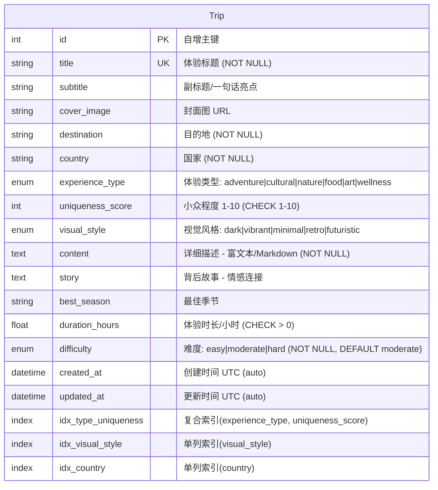

# 飞猪「100种不可思议旅行」— ER 图

## 实体关系图



## 设计说明

### 为什么是单表设计？

当前业务场景下，100 条精选体验由编辑团队集中管理：

| 考量点 | 单表方案 (当前) | 多表范式 |
| 数据量 | ~100 行 | ~100 行 |
| 查询复杂度 | 单表 SELECT + WHERE | 需要 JOIN 2-3 表 |
| 写入频率 | 极低（编辑手动发布） | 极低 |
| 读取模式 | 列表/详情/随机 | 列表/详情/随机 |
| API 响应构建 | ORM 对象 → Pydantic 直出 | 需合并关联对象 |

结论：**100 条数据不需要范式化**。单表设计避免了无意义的 JOIN，Pydantic schema 直接从 ORM 对象构建，响应延迟最低。

### 未来扩展路径

当产品演进到以下阶段时，可平滑迁移：

1. **标签系统** → 新增 `tags` 表 (M:N 关系)
2. **多图支持** → 新增 `trip_images` 表 (1:N)
3. **用户收藏/评价** → 新增 `user_trips` 表 (M:N, 带 rating)
4. **多语言** → `title`/`content` 字段改为 JSON 存储，或引入 `trip_i18n` 表

### 索引策略

```
idx_type_uniqueness (experience_type, uniqueness_score)
  → 覆盖最高频查询: "筛选 adventure 类型 + 小众程度 ≥ 7"
  → WHERE experience_type = ? AND uniqueness_score >= ? ORDER BY uniqueness_score DESC

idx_visual_style (visual_style)
  → 视觉风格筛选: "给我所有 futuristic 风格的体验"

idx_country (country)
  → 国家维度: "北欧有哪些体验" — 预留，当前列表接口不暴露 country 参数
```
